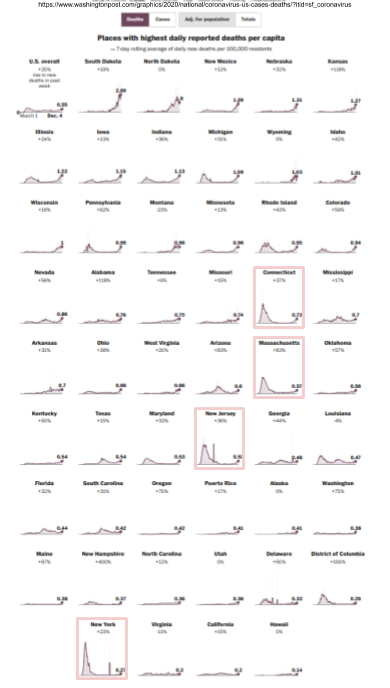

# covid-death-time-chart-patterns
A feeble attempt to group states by their patterns of daily deaths over time. 

Example:  See image below, edited from https://www.washingtonpost.com/graphics/2020/national/coronavirus-us-cases-deaths/?itid=sf_coronavirus
MA, NY, CT, NJ are quite similar in pattern of daily deaths over time (huge peak in April 2020, pretty flat since then, small rise late Fall 2020).  Maybe try to group them into about 8 or so groups.  

See https://covidtracking.com/data/charts/us-daily-deaths 
That is grouping states into virus-health-arbitrary regions. I want to try to group them by virus-health-regions. 

Plan:
Pull data from https://raw.githubusercontent.com/CSSEGISandData/COVID-19/master/csse_covid_19_data/csse_covid_19_time_series/time_series_covid19_deaths_US.csv
By state.
Average daily deaths from day 1 through 7 of each month from March 2020 to current date.
Each state would then have an array of 9 (through Nov 2020) values.  
Calculate the distances of the states from each other in 9-dimensional space.
Something like that.

But first, let's just try to automate calculating those 9 numbers for each state. 

TODO:  Try curl apis from https://api.covid19api.com/countries or perhaps elsewhere

This is a complete learning experience for me. Suggestions welcome--thanks!

